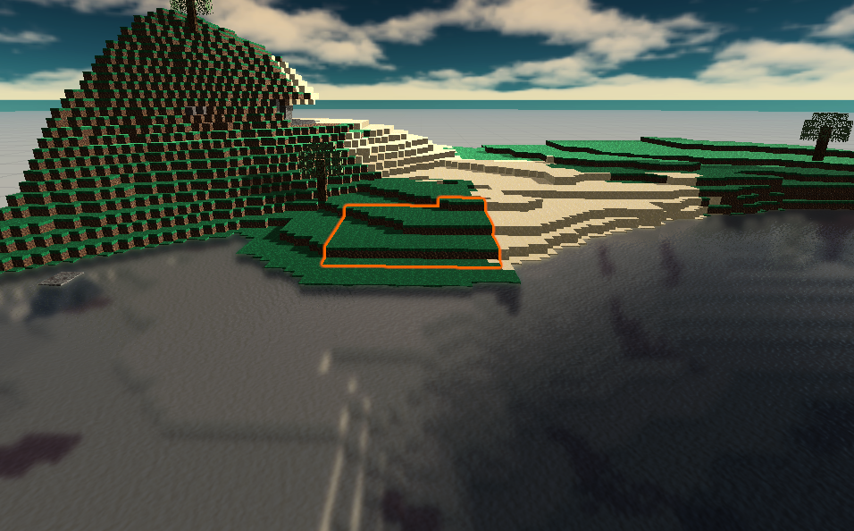
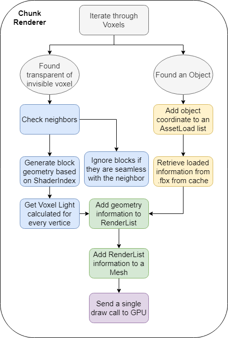

# Chunk Rendering

Considering that the Chunk Renderer was one of the first things Draconic Revolution had implemented, this Game Detail Document took a huge amount of time to be made. The reason for that is the Chunk Renderer being constantly changed and also having the overall approach changed. As of the Pre-Alpha development, the approach was set in stone, so here is the details.

## What is a Chunk?

Since the terrain is procedurally generated, the systems need to know at what point to stop generating. For that, we segment the terrain into 16x16x256 chunks of blocks. That right there is a chunk, a group of blocks that occupy a certain place in the world.

In the following image, a chunk is highlighted in orange.

## Voxels
Draconic Revolution is a voxel-based game. But what is that about?

It's natural for early game developers that want to make "block games" to just instantiate a Cube whenever a cube is needed. You can make a game like that, yes, but it wouldn't run as fast as you believe. Drawing cubes is expensive and a Chunk can have up to 65536 cubes in it. That would be a huge amount of vertices and 65536 draw calls to the GPU.

As you can see, thinking of the blocks in a block game as cubes is not right. To make it work, we have to think of them as Voxels.

To start thinking about Voxels, consider the following thought exercise:

> Imagine a 6-sided die. No matter the way you position it in a surface, you can only see at most 3 of its faces. The other 3 are culled behind it and don't need to be rendered.
> Now apply that to a Renderer, where each block can cull the faces of others. Example: you don't need to render the sides of two stone blocks touching each other.

**So in general, Voxels are discrete positions in space that can have information about the geometry contained in this space.**

**A Voxel Rendering Pipeline is a renderer that checks for what faces of a Voxel should and shouldn't be rendered.**

## Voxel Information
The classes used to hold Voxel information are *VoxelData* and *VoxelMetadata*.

VoxelData holds the following information:

1. Block Data (xyz) -- the block that is located at that voxel
2. HeightMap (xz) -- the height of the first detected light-affecting voxel on that chunk
3. RenderMap (xz) -- the height of the first detected non-invisible voxel on that chunk
4. ShadowMap (xyz) -- contains the Shadow Codes used to apply Voxel Lighting
5. LightMap (xyz) -- contains the Voxel Light information for a given Voxel
6. CeilingMap (xz) -- contains *true/false* information on whether there are any non-invisible voxel in every y-pillar on this chunk
7. 
VoxelMetadata holds the following information:

1. State (xyz) -- the current state of given block
2. HP (xyz) -- the current life points of the given block 

All this information is used by the Renderer to figure how where and how to render voxels.

## Block vs Objects
It's important to distinguish what Blocks and Objects are from now on, since they are completely different things and are handled separately.

A block is a voxel type of content that has its geometry generated by the Renderer. 
An object is a voxel type of content that has its geometry stored in a *.fbx* file and is loaded by the Renderer.

There are lots of distinguishing characteristics to both of those, but it's important to note the main similarities they have so that the Renderer breakdown is easier to understand.

## Block Information
The following is a list of information every block and object has that affects how the Renderer does its job

1. Solidness -- if this block is collidable
2. Transparent -- if should render connected voxel faces'
3. Invisible -- if should render at all
4. Affect Lighting -- if this block decreases light level (ex: light passing through water is filtered)
5. Liquid -- If block is considered a liquid type
6. Seamless -- If should render neighbor voxel faces if they are the same block
7. Luminosity -- the amount of light this block emanates and the state offset for it to emit light
8. Washable -- if this block can be destroyed by flowing liquids
9. NeedsRotation -- if this block has rotation necessities
10. DrawRegardless -- if this block should be rendered regardless of any rule set on the Renderer
11. ShaderIndex -- the Shader this block should be rendered in

## The Rendering Process
It's important to notice that the Chunk Renderer uses a *"9-way rendering"* approach. That means that, since we have possible chunk borders, we need the neighboring chunks to accurately verify how the blocks in the borders should be drawn.

The 9-way rendering approach does just that. It will only render the middle chunk once all 8 surrouding chunks are available in the Chunkloader. With that approach, we would have to wait a little bit more to have chunks rendered and will have to load one extra ring of chunks per render distance, but we do get perfect rendering on the first attempt.

The steps the Chunk Renderer takes to render a chunk is as described.

