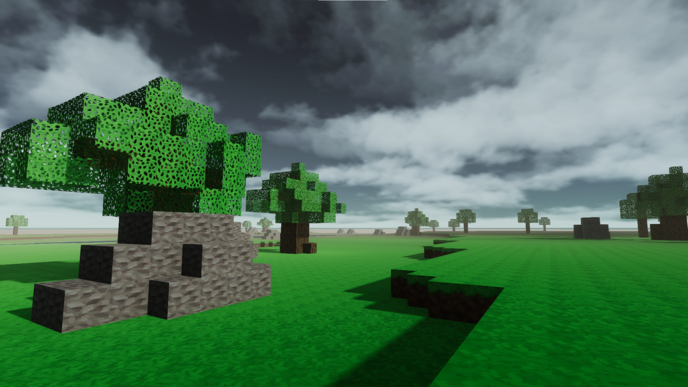
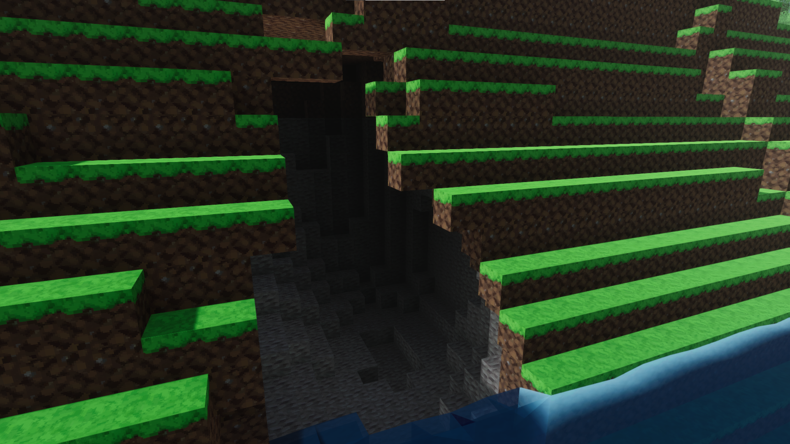

# Voxel Lighting

Polygonal and Voxel lighting were the first models to ever show up in Computer Graphics. Back in the day, Voxel lighting was deemed too computer-heavy to be calculated and was quickly forgotten by the community. The fast and all-purpose Polygonal model of renderization and lighting was developed upon throughout the years, making huge advancements towards realism with all sorts of effects, shadow casting, Raytracing, etc..

A few decades later, Voxel Lighting made a new appearence on the realm of games. Since computers have evolved, so did the computing power necessary to run these light models.

It's no secret that Draconic Revolution is a Voxel-based game. Yet it was using the famous Polygonal model of lighting. Using Polygonal Lighting in a Voxel world generates all sorts of lighting and shading artifacts. Sometimes, places were simply too dark or too lit up. There was no middle ground and definitely the transitions were way too noticeable.

The whole idea of this document is to explain how Draconic Revolution not only had a brand-new implementation of Voxel Lighting, but also had it implemented on-top of the current Polygonal model with all of its perks and realism features.

### Topics

 - What is Voxel Lighting?
 - Step-by-Step implementation
 - Extra Lights
 - Custom Interpolation Shaders
 - New Vertex Shaders
 - Ground Emission Problem and Solution
 - Moving Light Problem and Solution

## What is Voxel Lighting?
In the real world, light floods into a room, and will bounce around and to other unlit rooms. This behaviour can be done in Unity HDRP, but not for non-static procedually generated objects. And well, if you don't know Draconic Revolution, then let me tell you a secret: we have the **worst** of all rendering worlds here. We have non-staticism (object properties can and will change), procedually generated (objects aren't created prior to runtime), can't be lightmapped by Polygonal Lighting (can't have lightmaps baked to them for quick and precise lighting) and can't have light bounces in real-time (light won't scatter off of hit surfaces).

I knew that to make the perfect lighting, I would need to fix most of the inherent problems that came with the nature of the game. So Voxel Lighting was my way out!

Voxel Lighting doesn't care (too much) about pixel light rays being shot, but it cares about shooting voxel-sized light rays. In simpler terms, Voxel Lighting implements a local light level for every Voxel in the world. 

**No, we are not creating real-time lights for every voxel in the world, keep reading!**

## Step-by-Step Implementation

### The Process

### ShadowMapping
Shadowmapping is the process where the shadows are calculated given the light information in the Scene. While it's pretty straightforward in Polygonal Lighting, Shadowmapping in Voxel Lighting is definitely different.
For every Voxel in a chunk, we need to find out the ShadowCode for them. The ShadowCode is defined as following:

 - Defined as 0 if current Voxel is a solid block
 - Defined as 1 if current Voxel is a transparent block
 - Defined as 2 if current Voxel has contact with direct sunlight
 - Defined as 3 if current Voxel receives light from the sun but is not in contact with it (like light being shined into the underground)
 - Defined as 7, 8, 9, 10 if current Voxel receives light from a neighbor chunk, each code representing the direction the light received travels

During the ShadowMapping process, only ShadowCode 0, 1 and 2 is set. The only exception are the 7-10 ShadowCodes that are not tampered with if the current ShadowMap has them at some point.

## LightMapping

Now things get fun. Lightmapping is meant to assign the local light value of each Voxel in a chunk.
The algorithm is pretty simple:

 1. For every sunlight affected voxel, assign Light Level 15
 2. Add the unlit neighbords of these sunlight affected blocks to a Breadth-First-Search queue
 3. Iterate through the queue, lowering the light level by one each time and set these voxels to their respective light levels and ShadowCode 3.
 4. Find every directional light received from other chunk voxels (the ones that have untampered ShadowCode 7-10) and add them to another Breadth-First-Search queue.
 5. Iterate through the queue, checking if the received light should be further propagated

## LightPropagation

Imagine that we have the entrance to a cave perfectly fitting a chunk and this chunk's neighbor is directly into sunlight. Given the implementation of lighting so far, one chunk would be totally dark while the other would be totally lit. It makes sense that light should propagate between chunks so that this scenario won't happen.

We check compare the ShadowCode of the bordering blocks of every two chunks to figure out what WorkCode should be assigned to the pair. A WorkCode simply represents a routine of handling the given pair of ShadowCodes. The following tables can explain it better:

| **Shadow Pair** | **Shadow Translation** | **WorkCode** | **What the WorkCode means** |
|--|--|--|--|
| 0 & 0  | Border blocks are both solid | None | Do nothing |
| 0 & 1 | Solid block and Empty/Transparent block | None | Do nothing |
| 0 & 2 or 3 | Solid block and Sunlight affected block | 1 | Set neighbor chunk to update without propagating their light |
| 1 & 1 | Both transparent and unlit blocks | None | Do Nothing |
| 1 & 2 or 3 | Transparent unlit and Sunlit block | 2 | Propagates light to neighbor chunk and set their ShadowCode as directional (7-10) |
| 2 & 2 | Both blocks in direct sunlight  | None | Do Nothing |
| 2 & 3 | In direct sunlight and indirectly lit by sun | 6 | If sunlight from one is stronger than the local propagated indirect light of other, then propagate |
| 3 & 3 | Two indirectly sunlit blocks | 3 | Propagate to the chunk that has the lowest light level |
| 0 & 7-10 | Solid block and directional shadows | 1 | Set neighbor chunk to update |
| 1 & 7-10 | Unlit block and directional shadows | 4 | Propagates to a third chunk or dies out because of lack of transmitter shadows (Shadows that have ShadowCode 2 or 3) |
| 2 or 3 & 7-10 | Direct sunlit block and directional shadows | 5 | Tries to propagate to the chunk with the lowest light level overwritting directional shadows |
| 7-10 & 7-10 | Directional shadows meet other directional shadows | 5 | Tries to propagate to the chunk with the lowest light level overwritting directional shadows |

Okay, that seems hard... and it was.
Also there are light bounces. Here, we are describing a simple two-chunk propagation, but there's also the complex two-chunk propagation and multi-chunk propagation.

A complex two-chunk propagation was nicknamed "Chunk Bounce". It happens when a block of Chunk 1 propagates to Chunk 2 and the same light comes back to Chunk 1. This can happen up to 4 times.

Multi-chunk propagation is when a single block in a chunk propagates directional light to multiple ones (like the corner border of 4 chunks).

## Sending data to the GPU

This part is the one that sends the Light Level calculated for the Voxels to their respective vertices. That part shouldn't be hard, right? WRONG!

In order to get a decent gradient out each vertice, a Voxel's vertex light shouldn't always be the same as its local light level. It must take into consideration the light of it's neighbords as well, especially bordering chunks. For that, a 2D Convolution is run on the neighborhood of a voxel to define its 4 vertices' light level. This number is sent to the GPU in the UV Channel 3 (uv[3] for reference).

Explaining like that seems easy, but it took me over a month to get it right  :(

## Extra Lights

Alright, now take everything that was just said in the entire past Section and LITERALLY double that. Extra Lights are lights that don't come from the sun (torches, magic, light switches, etc.). They are handled in a similar way, yet, they lack the ShadowCode 2. Whenever a Voxel contains both Natural Light and Extra Light information, the highest valued one will be used by the Shader.

## Custom Interpolation Shaders
In order to get the modern look (and to work towards realism in a Voxel Lighting engine), we need to get perfect gradients between light levels. So for every pixel, there must have a gradient happening... Just imagine how hard and CPU intensive it would be to Lerp every pixel on the screen...

Luckily, the Vertex->Fragment shader struct does that work for us. For those unaware, the Vertex Shader operates on Vertices, sends the data to Interpolators that create the perfect interpolation of values (like normals and colors), so that the Fragment Shader can work on every pixel independently.

Implementing these Gradients in Shader Graph requires tweaking the Vertex Shader (don't be afraid, really) by adding the Light Level information to a Custom Interpolator, and retrieving it later to use in the Fragment Shader.

By the way, the Light Information is used as a Color multiplier. Light Level 0 means that whatever Color should have been drawn in a pixel becomes black, and so on. That's how we cast "Voxel Shadows".

## New Vertex Shaders

The Chunk Building pipeline was revamped, supporting unlimited Custom Shaders. That made me change the Water Shader and adding the new Leaves Shader. Now, both Leaves and Water move.

## Ground Emission Problem and Solution

After all of this, we still had a problem. Well, you see, what we are doing here is basically casting "Voxel Shadows". The real light still comes from the Polygonal model, so if the sun shines light into object A, and its shadows obscures object B, then Voxel Lighting won't help object B. That may make sense to most of you, but you should realize that the Underground would be dark even if we poke a hole in the ceiling to the surface.

The ground of the caves were 100% dark while the walls and ceilings were lit. Why is that? Simple, the materials weren't Double Sided. That means that the Shadows casted by the surface ground affected the only the places where the normals were similar, a.k.a the cave ground. Switching to Double Sided made everything darker.

To fix the extreme darkness now, the concept of Ground Emission was added. Emission is the amount of light coming from an object. Ground Emission makes all sky-facing normal voxels emit light given their light level. That not only makes the ground normally visible, but also shines light into the surrounding walls and ceiling, simulating real-time and real-life light bounces, something that is unique to Draconic Revolution in terms of Voxel Lighting implementation.

## Moving Light Problem and Solution

This is definitely the most confusing glitch I have found when dealing with Light. This effect that has absolutely no formal name (Shadow Sizzling, maybe?) was stumbled upon.

The cause was rather unexpected: the sun is moving too fast and too slow at the same time.
Let me explain. It seems like Polygonal Lighting has a very hard time dealing with moving directional lights. The real-time ShadowMapper seem to "switch frames" in a weird way whenever Shadows need to be recalculated too quickly. To make matters worse, the rotation of the directional light also can make the sizzling more evident.

To fix that, I had to drop the main Directional Light's update rate to a few times a second, instead of every 2 frames. Also, the trajectory of the main light was changed. It slightly curves away from the center at 12PM and goes back to center until sunset. Additionally, I also increased the Shadow Resolution and Distance.

# Results

