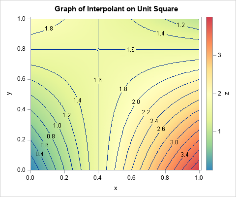
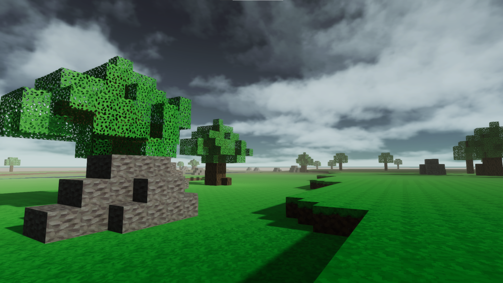
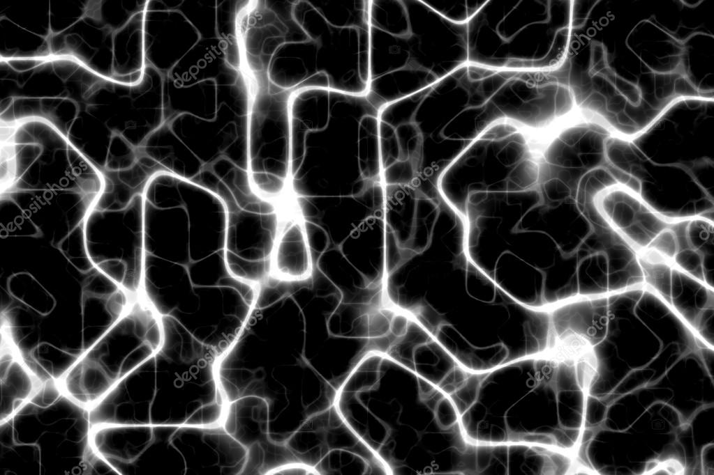

# World Generation

If you are here, you are probably very curious about Procedural Generation. I don't blame you. This game pretty much started because of my curiosity on this topic. So let's go!

## Procedural vs Random Generation
There is a very common misconception about what Procedural Generation actually is. As a programmer, it's common to think that using a simple *Random()* function a lot of times will eventually generate you a very good world in which you can play. That is, indeed, true if you have a lot of free time to generate stuff. And this is what we call 'Random Generation'.

Now, for this generation to become *Procedural*, you need to be able to regenerate the same data everytime, given an initial condition. A *seed* is a common term for defining a Key value that serves as a global Randomness controller. You can replicate an entire world if you just happen to know it's seed.

**In short, every world has a seed value**. Currently, the World Generator supports seed numbers from 1 to 1 million.

Now that we have the World Seed, we can start doing actual Procedural Generation. But what are we generating? **We are generating the Heightmaps!** Whenever we use our *Random()* function to generate something, we are generating the height of a certain column of blocks. You can see that it's pretty easy to generate a terribly chaotic terrain with that. A column of blocks can generate at height 0, while the one just by it's side can be at height 99. How do we balance it to generate a smoothly transitioned terrain?

The answer to this question is...

## Perlin Noise

This right here is the visual representation of a 2-dimensional Perlin Noise function. Pretty neat, right? But what does it do?

Perlin Noise is a considerably fast and smooth noise function very suitable to the task of generating heightmaps. Imagine that we are sampling a pixel in that image everytime we call our custom *Random()* function. If the pixel we picked is darker, it's value is closer to height 0. If it's brighter, then it's closer to height 99. All we have to do now, is to use the Chunk coordinates and World Seed in our custom *Random()* function to offset the Perlin Noise just enough to get an interesting heightmap curve.

Normally, the terrain will be hilly and somewhat smooth, but we can still do more! We can generate a new layer of Perlin Noise (using a different multiplier inside our custom *Random()* function) and get the mean of those together. Here, we are adding turbulance to the terrain. Those layers that are added and taken their mean are called **octaves**.

Right now, what we've been calling **our Random() function**, is actually the return value of the **Perlin Noise 2D function** given the keys we have set as input.

## Height Sampling

It's common to see different biomes with different base heights. We can add that!
Given that the *Perlin Noise* is limited between 0 and 1, we can add a multiplier of the desired max and minimum height easily. Thus, we have taken the first step towards controllable heightmapping.

## Bilinear Interpolation

Great! Now we have Procedural terrain being generated given the World Seed, the chunk coordinates and some other key values you may want to put in (In our case, we also use a hash value in every biome). We probably won't trip into any trouble, will we? **Wrong!**

 1. Sampling all block columns using Perlin Noise can be very slow
 2. If you want to generate a more chaotic biome, the results may be dissapointing. Extremely non-smooth terrain is a big no no.

How do we fix these problems though? With the power of Mathematics! More specifically, **Billinear Interpolation**! 

 

In short, billinear interpolation is like 'filling in-between' of 4 pivot points set in a 2D plane. 
To make our code faster, we don't need to sample 16x16 block columns for every chunk. We can sample only 4x4 of them, evenly spaced, and use Billinear Interpolation to fill in the blanks around them.
Since we are 'filling in the holes' based on our pivot points (that were sampled using the Perlin Noise), we get a very smooth terrain, with no 'flying blocks'.

## Multi-Layer Terrain

Now that we have a very smooth terrain, you probably wanna know how we managed to work with different blocks in their generation, right? Of course you do!

When we are generating a chunk, every biome has a set of layers that it needs. A Plains biome has a low altitude grass layer, that is immediately followed by a Dirt layer 1 block below it. After that, there's a Stone Layer 5 blocks below the Grass layer.... and so on.

In order to do that, we simply generate all of these different heightmaps and then add them together into a 3D Voxeldata class. **The order in which the maps are added to the generation queue means everything!!**. The first layer will always be the lowest of them all, while the second layer will generate itself until it's generation hits the layer below, and so on. You may think that the biggest layers height-wise would be the last ones in the queue. You are partially right. The last layer is usually the Water layer. Since it only generates below a certain treshold, it's common for the algorithm to just stop for entire columns right away if the terrain is not low enough. It's a pretty neat algorithm, if I might say!

## Generating Structures

I know, I know... we don't have fancy cities or dungeons. So what are these Structures? They are our trees, dirt patches on the Underground, boulders on the surface and Metal Ore veins... in the current Phase 1 of development, of course.

Generating these is quite a pain, not gonna lie. So let's go.
First of all, every structure is procedurally rotated. Of course, you don't want your whole forest to always be facing north, right? Also, your structure needs to have a center point and a write condition. Let's go through the write conditions first.

A write condition is the answer to the question *I'm trying to generate a structure that will affect this block. What should I do about it?*. And the possible answers are:

 1. **Overwrite All**: There used to be a another block here? Too bad for it.
 2. **Free Space**:  Is there a block in my way? ABORT THE WHOLE OPERATION!
 3. **Specific Overwrite**: So I see that you hate Grass Blocks... You can take their place.

Some structures also have the possibility of disconsidering the Air Blocks in them. Metal Ore veins are an example of that. Trees should consider their Air block information, since you want free space below tree branches for players to walk.

### The Pre-Generation problem

In wide structures, it's common to see it taking more than one chunk. There we have a big problem called *The Pre-generation problem*. Let's say that we are generating a structure in a chunk, but the other half of it is in an undiscovered chunk. How do we tell the undiscovered chunk to build the rest of the structure whenever it generates? Difficult, eh?

Unfortunately, the solution to this problem only came after implementing the World Saves. In short, to save pregenerated information to an unexisting chunk, you gotta make it partially exist. Generate a whole chunk that only has the half-structure block information, mark this chunk as pre-generated and save it. Once the ChunkLoader tries to load it, it will realize this chunk exists, but is pregenerated. So the ChunkLoader should generate this chunk as it would any other, right? **Wrong!**
The ChunkLoader cannot generate it normally, because it would *erase the structure data pre-generated into it*. So this post-generation must ignore already placed blocks.

## Making Big Holes

Cave Systems are a big part of exploration games. Ours couldn't be different. In short, to do cave systems, we used a different design of the *Perlin Noise*, it's the **Ridged-MultiFractal Noise**.

This noise, is the **squared version of the Perlin Noise 3D**. Why do we need it to be squared? Because it draws those very bright tunnels through the noise. It's perfect for tunnel based caves, and the inputs can be tweaked to make all sorts of procedural cave shapes.

So we create a turbulance map and delete all the blocks the *RidgedMultiFractal3D()* flagged as a cave block. Of course, we also set height limits to the caves, so that we don't have sky caves, for example.

# Congratulations

Now you know a little bit more about Procedural Generation and what was used in order to generate the beautiful worlds that you see! 
