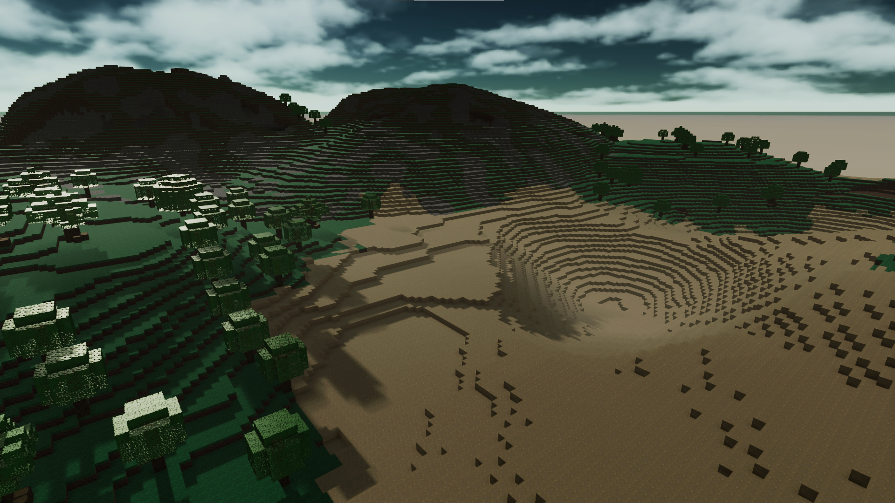
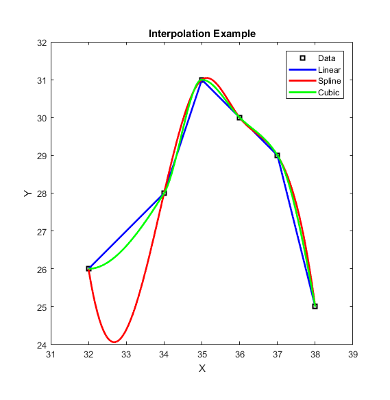

# World Generation

If you are here, you are probably very curious about Procedural Generation. I don't blame you. This game pretty much started because of my curiosity on this topic. So let's go!

## Procedural vs Random Generation
There is a very common misconception about what Procedural Generation actually is. As a programmer, it's common to think that using a simple *Random()* function a lot of times will eventually generate you a very good world in which you can play. That is, indeed, true if you have a lot of free time to generate stuff. And this is what we call 'Random Generation'.

Now, for this generation to become *Procedural*, you need to be able to regenerate the same data everytime, given an initial condition. A *seed* is a common term for defining a Key value that serves as a global Randomness controller. You can replicate an entire world if you just happen to know it's seed.

**In short, every world has a seed value**!

Now that we have the World Seed, we can start doing actual Procedural Generation. But what are we generating? **We are generating the Heightmaps!** Whenever we use our *Random()* function to generate something, we are generating the height of a certain column of blocks. You can see that it's pretty easy to generate a terribly chaotic terrain with that. A column of blocks can generate at height 0, while the one just by it's side can be at height 255. How do we balance it to generate a smoothly transitioned terrain?

The answer to this question is...

## Perlin Noise

This right here is the visual representation of a 2-dimensional Perlin Noise function. Pretty neat, right? But what does it do?

Perlin Noise is a considerably fast and smooth noise function, very suitable to the task of generating heightmaps. Imagine that we are sampling a pixel in that image everytime we call our custom *Random()* function. If the pixel we picked is darker, it's value is closer to height 0. If it's brighter, then it's closer to height 255. All we have to do now, is to use the Chunk coordinates and World Seed in our custom *Random()* function to offset the Perlin Noise just enough to get an interesting heightmap curve.

## Noise Maps
Okay, we have procedurally generated numbers now. What is next? 
**Noise Maps**, of course!

We can consistently generate noise fields to generate and mix different terrain traits!
We have a total of 8 Noise Maps:

 1. Base Map (a.k.a. base height map)
 2. Erosion Map
 3. Peaks Map
 4. Temperature Map
 5. Humidity Map
 6. Patch Map
 7. Cave Map
 8. Cave Mask Map

### The Surface
To generate the surface terrain, **Base, Erosion** and **Peaks** maps are used. High base values make the terrain higher or lower. Higher erosion makes the terrain more flat and lower, while high erosion makes it higher and more prone to microchanges. High peak values make sudden high lands and low peak values dig out water ways like rivers.

### The Biomes
To figure out what biome should be placed in what given chunk, the **Base, Erosion, Temperature** and **Humidity** maps are used.

The biomes are categorized in height types first, like **Ocean-like, Low, Mid, Peak** and put up against a value table comparing Base and Erosion maps.

|Base vs Erosion|0.0| 0.2| 0.4 |0.6|0.8|1|
|--|--|--|--|--|--|--|
|0.0|Ocean|Ocean|Ocean|Ocean|Ocean|Ocean|
|0.2|Ocean|Ocean|Ocean|Ocean|Ocean|Ocean|
|0.4|Ocean|Ocean|Ocean|Ocean|Low|Low|
|0.6|Ocean|Ocean|Ocean|Low|Low|Mid|
|0.8|Ocean|Mid|Mid|Peak|Peak|Peak|
|1|Ocean|Mid|Peak|Peak|Peak|Peak|

Once the type of biome is resolved, every biome type has a Temperature vs Humidity table similar to the above to define what biome it is.

### The Underground
To dig out caves, lots of techniques were planned: **simple 3D perlin subtraction, Topology Analysis State Machine Cluster™** (TASMC, which was discarded, but deserved a Game Detail document of its own!) **and Conditional Noise Slices**. None of them achieved the desired result.

So the solution was simpler than all of those complex solutions... just add another noise map!
So now, to dig out caves, we use the **Cave** and **Cave Mask** maps.

Noise Maps are 2D, but the caves are dug in a 3D fashion. It works nicely because both of these noises are the only ones that accept an *(x, y, z)* input. While the Cave Noise shapes the caves, the Cave Mask Noise drives the digging towards a certain, procedually chosen, area.

### The Structures
For that, the **Patch** Map is used. Its idea is to be the noise that defines where structures and mini-structures should be placed around the chunks.

## Spline Interpolation
In order to make the terrain more interesting and have more variation and more *controlled* variation, spline interpolation was chosen to modify the Noise Maps. So now, every Noise Field has a Spline Interpolated function that defines how the values are spread in the Field, basically shaping the Noise Map to have whatever distribution we want.

## Octaves and Sigmoid Approximation Transformation
Sampling multiple Noise Maps that apply different traits to a terrain can generate interesting terrain. But having multiple different samplings from the same map can add even more detail. These additional samplings are called ***Octaves***.
Currently, the maps have the base sampling and one octave.

Since we use the mean of the sum of the samples, the Random() function's distribution goes from Uniform to Normal. To transform the octave sum result back to a Uniform distribution, we use Sigmoid Approximation, which is the computationally fastest and closest we can get to a Normal transformation.

## Bilinear Interpolation

Great! Now we have Procedural terrain being generated given the Seed and chunk coordinates. We probably won't trip into any trouble, will we? **Wrong!**

 1. Sampling all block columns using Perlin Noise can be very slow
 2. If you want to generate a more chaotic biome, the results may be dissapointing. Extremely non-smooth terrain is a big no no.

How do we fix these problems though? With the power of Mathematics! More specifically, **Billinear Interpolation**! 

 

In short, billinear interpolation is like 'filling in-between' of 4 pivot points set in a 2D plane. 
To make our code faster, we don't need to sample 16x16 block columns for every chunk. We can sample only 4x4 of them, evenly spaced, and use Billinear Interpolation to fill in the blanks around them.
Since we are 'filling in the holes' based on our pivot points (that were sampled using the Perlin Noise), we get a very smooth terrain, with no 'flying blocks'.

## Multi-Layer Terrain

Now that we have a very smooth terrain, you probably wanna know how we managed to work with different blocks in their generation, right? Of course you do!

When we are generating a chunk, every biome has a set of layers that it needs. A Plains biome has a low altitude grass layer, that is immediately followed by a Dirt layer 1 block below it. After that, there's a Stone Layer 5 blocks below the Grass layer.... and so on.

So the first step is to generate the terrain using only stone and air blocks.

After it has been done, we add Surface Decoration to it. Surface decoration is any base surface block that populates a biome. 

After that, we apply biome blending to biome borders. For example, whenever we have a transition between plains and desert, some sand blocks will get into the plains biome side and some grass will get into the desert biome. That's a way of smoothing out the biome transition.

After that, water is applied at sea level and caves are dug out.

## Generating Structures

I know, I know... we don't have fancy cities or dungeons. So what are these Structures? They are our trees, dirt patches on the Underground, boulders on the surface and Metal Ore veins... in the current Phase 1 of development, of course.

Generating these is quite a pain, not gonna lie. So let's go.
First of all, every structure is procedurally rotated. Of course, you don't want your whole forest to always be facing north, right? Also, your structure needs to have a center point and a write condition. Let's go through the write conditions first.

A write condition is the answer to the question *I'm trying to generate a structure that will affect this block. What should I do about it?*. And the possible answers are:

 1. **Overwrite All**: There used to be a another block here? Too bad for it.
 2. **Free Space**:  Is there a block in my way? ABORT THE WHOLE OPERATION!
 3. **Specific Overwrite**: So I see that you hate Grass Blocks... You can take their place.

Some structures also have the possibility of disconsidering the Air Blocks in them. Metal Ore veins are an example of that. Trees should consider their Air block information, since you want free space below tree branches for players to walk.

### The Pre-Generation problem

In wide structures, it's common to see it taking more than one chunk. There we have a big problem called *The Pre-generation problem*. Let's say that we are generating a structure in a chunk, but the other half of it is in an undiscovered chunk. How do we tell the undiscovered chunk to build the rest of the structure whenever it generates? Difficult, eh?

Unfortunately, the solution to this problem only came after implementing the World Saves. In short, to save pregenerated information to an unexisting chunk, you gotta make it partially exist. Generate a whole chunk that only has the half-structure block information, mark this chunk as pre-generated and save it. Once the ChunkLoader tries to load it, it will realize this chunk exists, but is pregenerated. So the ChunkLoader should generate this chunk as it would any other, right? **Wrong!**
The ChunkLoader cannot generate it normally, because it would *erase the structure data pre-generated into it*. So this post-generation must ignore already placed blocks.

# Congratulations

Now you know a little bit more about Procedural Generation and what was used in order to generate the beautiful worlds that you see! 
