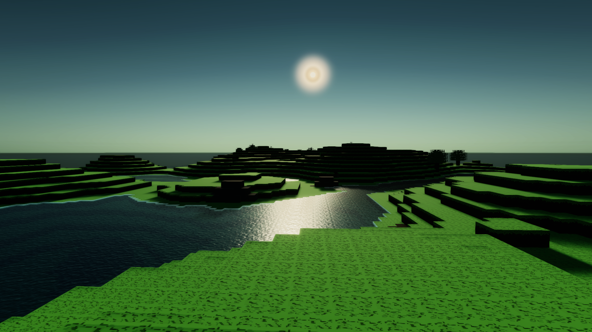
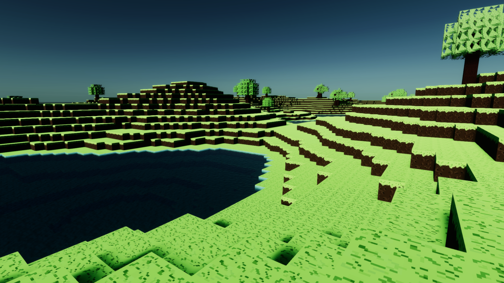
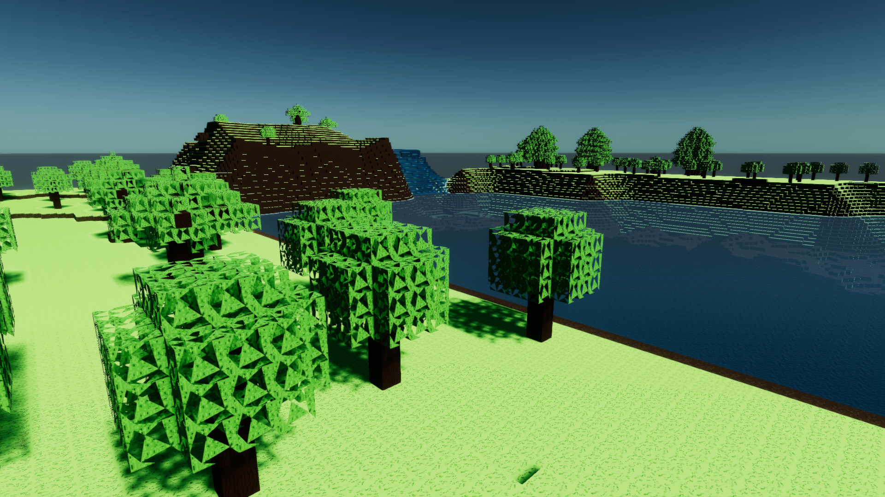
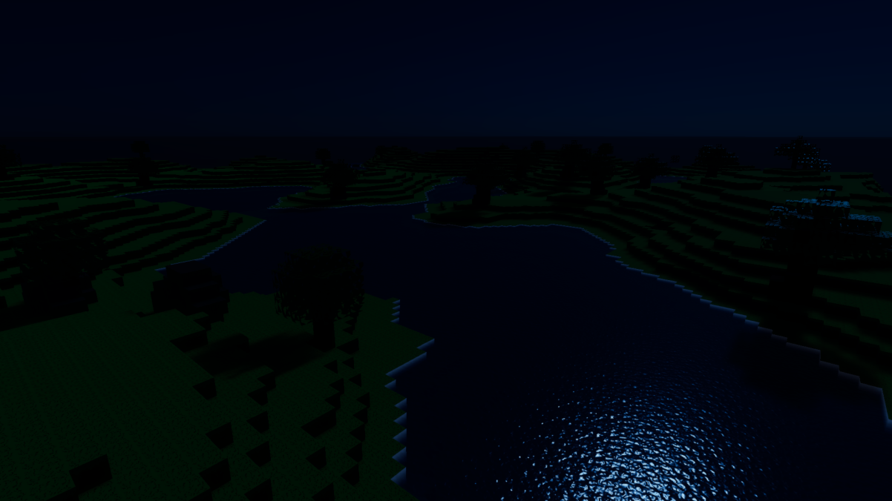
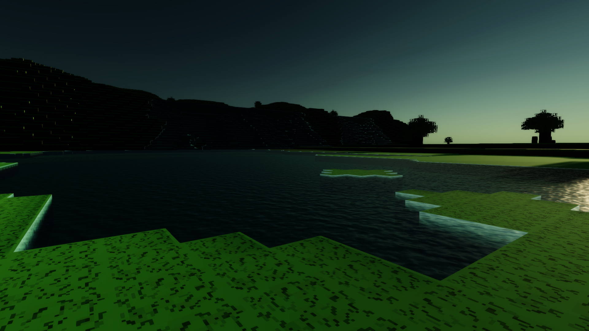

# Draconic Revolution
Draconic Revolution is a procedural voxel-based sandbox online RPG currently in development. This game was inspired in my very own Homebrew table RPG System, created in 2016 and played by multiple parties up until today. This game is meant to be a digital version that fully implements all core mechanics and the main campaign of the system. Draconic Revolution was made using the Unity Engine. 

## Development
Right now, the development of the game is being separated into 4 different Dev Phases. Each of them will be listed down below, as well as their content. We are projecting all the content we intend to add into our game in this list.

### Phase 1 (Completed)

 - Core Voxel Engine
 - Procedural Terrain Generation
 - Procedural Structure Generation
 - Procedural Cave Generation
 - Different Biomes
 - Basic Player Movement
 - Block Breaking/Placing/Interating Mechanics
 - Block Updates and Falling Trees
 - Day/Night Cycle and Global Time
 - High Definition Rendering Pipeline with PostFX
 - World Data Save
 - Burst Compiling (LLAC Compiling)
 - Complex Water Shader
 - VisualFX Support

### Phase 2 (Currently InDev) [Alpha]

 - Dedicated and Local Server Multiplayer
 - Multiplayer Party System
 - Inventory, Items and Crafting
 - Character and Enemy models
 - Character Creation
 - Basic Animations
 - Basic Artificial Intelligence
 - Block and Entity Damage
 - Basic Magic VFX and Animation
 - More Blocks and Biomes
 - Storage-type Blocks
 - Multi-Tier Core Chunk Generation
 - Audio Engine

### Phase 3 [Beta]

 - Full Skill Tree Implementation for every Skill
 - Custom Dungeons
 - Better Animations
 - Better AI
 - Procedural City Generation
 - Procedural Quest Generation
 - NPC Shopping
 - Multiple Races and Races Regions
 - Multiple Game Dimensions

### Phase 4 [Release]

 - 'Draconic Revolution' Campaign mode
 - Construction of Campaign Map
 - Campaign Quest Writing
 - Campaign Voice Acting
 - Character Development
 - Custom Dungeons and Cities 
 

# In-depth Technical Analysis

If you are curious about the development of the game and it's peculiarities, make sure to check the "Game Details" folder. There, a series of .md files will explain a certain aspect of the current complete development phase.

# Contribution

I'm thankful enough if you have read up until here. If you wanna contribute to this project, we are always accepting some volunteer work. If you have any abilities in the following topics, feel free to send an email to me!

 - Concept Artist
 - 3D Model Artist
 - Animation Artist
 - SoundTrack Producer
 - Voice Actor (Needed in Phase 3 and beyond only)

# Playtest the Game

Feel free to download the latest release at [this link](https://github.com/HFrajacomo/-Unity-Draconic-Revolution-RPG/releases)

